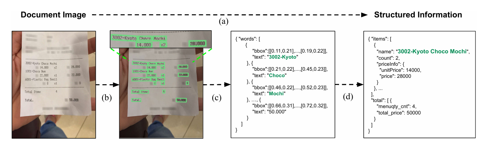
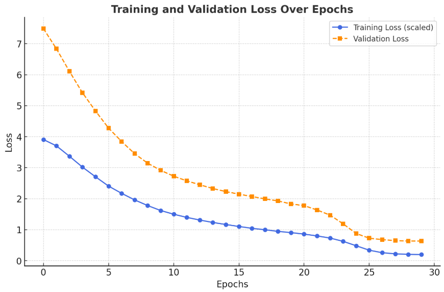

# 🧾 Donut Model Fine-Tuning for Receipt Parsing

  
*Visual Overview of Donut Model Architecture on its paper ([Source](https://arxiv.org/abs/2111.15664))*

A powerful implementation of the Donut (Document Understanding Transformer) model fine-tuned for extracting structured JSON data from receipt images. This project leverages the ICDAR-2019-SROIE dataset to create a robust document understanding solution.

---

## Example Output

---

## Features

- **Advanced Document Understanding**: Built on `naver-clova-ix/donut-base`
- **Efficient Processing**: Optimized for 720x960 receipt images
- **Smart Token Handling**: Dynamic special token generation
- **Training Optimization**:
  - Gradient Accumulation 6 steps with 2 batch size so total is 32
  - Cosine Learning Rate Scheduler
  - Mixed Precision Training (FP16)
  - Early Stopping

---

