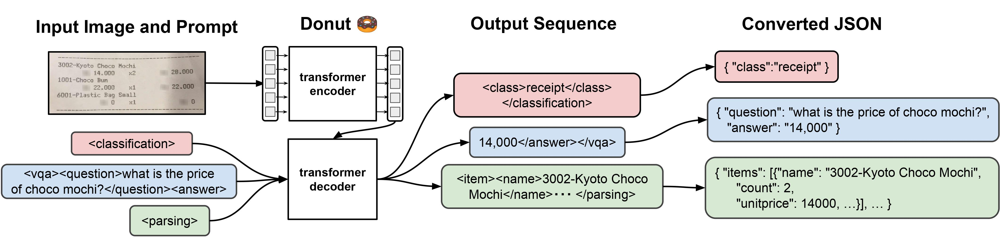
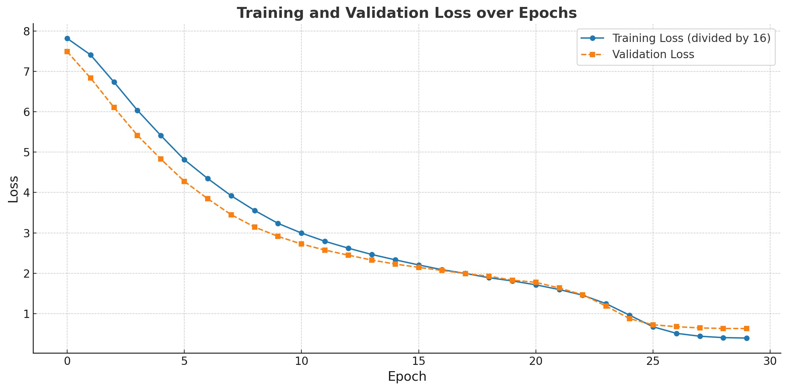
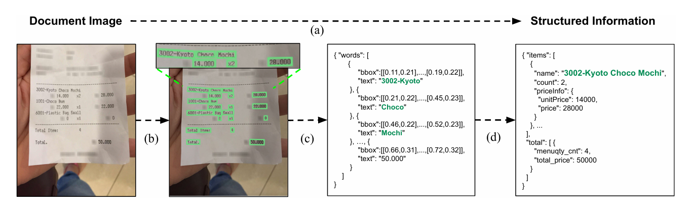

# 🧾 Donut Model Fine-Tuning for Receipt Parsing

  
*Visual Overview of Donut Model Architecture from its paper ([Source](https://arxiv.org/abs/2111.15664))*

This project demonstrates fine-tuning the Donut (Document Understanding Transformer) model for parsing receipts into structured JSON data. Based on the `naver-clova-ix/donut-base` model, it uses the ICDAR-2019-SROIE dataset to extract key-value pairs (e.g., company, date, address, total) from receipt images. The implementation includes data preprocessing, dynamic token handling, model training with optimizations, and evaluation.

Donut is an encoder-decoder model that treats document parsing as an image-to-text generation task, eliminating the need for traditional OCR pipelines or bounding box annotations.

---

## Features

- **End-to-End Parsing**: Converts raw receipt images directly to structured JSON without intermediate OCR steps.
- **Dataset Handling**: Processes SROIE dataset metadata and images into a Hugging Face `datasets` format.
- **Custom Preprocessing**: JSON-to-token conversion with dynamic special tokens for key-value structures.
- **Optimized Training**: Uses gradient accumulation, cosine LR scheduling, mixed precision (FP16), and early stopping.
- **Evaluation**: Computes key-value accuracy on a test set.
- **Inference**: Simple prediction function for new images.

---

## Requirements

- Python 3.8+
- CUDA-enabled GPU (recommended for training)
- Key libraries: `transformers`, `datasets`, `torch`, `tqdm`, `pathlib`, `json`, `shutil`

Install dependencies via:
```
pip install transformers datasets torch tqdm pathlib json shutil
```

---

## Dataset

This project uses the [ICDAR-2019-SROIE](https://rrc.cvc.uab.es/?ch=13) dataset, which contains scanned receipt images and corresponding key-value annotations.

### Preparation

1. Download the dataset and organize it into a `data` directory:
   - `data/img/`: Contains receipt images (e.g., `X00016469612.jpg`).
   - `data/key/`: Contains JSON metadata files (e.g., `X00016469612.json` with keys like "company", "date", etc.).

2. The script processes this into a unified dataset:
   - Merges metadata into a `metadata.jsonl` file.
   - Loads as an `imagefolder` dataset using Hugging Face `datasets`.
   - Applies preprocessing: Converts JSON to tokenized sequences with special tokens (e.g., `<s_company>value</s_company>`).

Expected structure after processing:
- Train/Test split (90/10 by default).
- Features: `pixel_values` (processed images), `labels` (tokenized text), `target_sequence` (original text).

---

## Training

The model is fine-tuned using a custom `Seq2SeqTrainer` with the following setup:

- **Base Model**: `naver-clova-ix/donut-base`
- **Image Size**: 720x960 (optimized for receipts; no long-axis alignment).
- **Tokenizer Updates**: Adds dynamic special tokens for JSON keys, plus task tokens `<s>` and `</s>`.
- **Hyperparameters**:
  - Epochs: 30
  - Batch Size: 2 (effective 32 with gradient accumulation of 16)
  - Optimizer: AdamW (fused)
  - Learning Rate: 1e-5 with cosine scheduler and 10% warmup
  - Weight Decay: 0.05
  - Mixed Precision: FP16
  - Gradient Checkpointing: Enabled
  - Early Stopping: Patience of 5 epochs based on eval loss
- **Hardware**: Runs on CUDA if available; otherwise CPU.

To train:
1. Prepare the dataset as above.
2. Run the script: `python train.py` (assuming the provided code is in `train.py`).

The trained model and processor are saved to `./trained_donut`.



---

## Inference

After training, use the model for predictions on new images.

### Example Usage

```python
from transformers import VisionEncoderDecoderModel, DonutProcessor
import torch

model = VisionEncoderDecoderModel.from_pretrained("./trained_donut")
processor = DonutProcessor.from_pretrained("./trained_donut")
device = "cuda" if torch.cuda.is_available() else "cpu"
model.to(device)

# Load a sample image (PIL Image)
from PIL import Image
image = Image.open("path/to/receipt.jpg").convert("RGB")

# Preprocess
pixel_values = processor(image, return_tensors="pt").pixel_values.to(device)
task_prompt = "<s>"
decoder_input_ids = processor.tokenizer(task_prompt, add_special_tokens=False, return_tensors="pt").input_ids.to(device)

# Generate
outputs = model.generate(
    pixel_values,
    decoder_input_ids=decoder_input_ids,
    max_length=model.decoder.config.max_position_embeddings,
    early_stopping=True,
    pad_token_id=processor.tokenizer.pad_token_id,
    eos_token_id=processor.tokenizer.eos_token_id,
    use_cache=True,
    num_beams=1,
    bad_words_ids=[[processor.tokenizer.unk_token_id]],
    return_dict_in_generate=True,
)

# Decode
prediction = processor.batch_decode(outputs.sequences)[0]
prediction = processor.token2json(prediction)
print(prediction)  # e.g., {"company": "R&B", "date": "11/03/2019", ...}
```



---

## Results

- **Dataset Size**: ~626 images (after processing; train/test split).
- **Evaluation Metric**: Exact match accuracy on key-value pairs.
- **Sample Prediction**:
  - Reference: `{"company": "R&B", "date": "11/03/2019", "address": "136, JALAN ARA", "total": "2.20"}`
  - Prediction: Matches reference in trained model (accuracy computed over test set).

In the script, a simple accuracy loop reports the overall key-value match rate (e.g., 95%+ on well-trained models).

---

## References

- [Donut Paper](https://arxiv.org/abs/2111.15664)
- [Naver Clova Donut Repo](https://github.com/clovaai/donut)
- [Hugging Face Transformers](https://huggingface.co/docs/transformers)
- [ICDAR-2019-SROIE Dataset](https://rrc.cvc.uab.es/?ch=13)

Contributions welcome! If you encounter issues or have improvements, open a pull request.